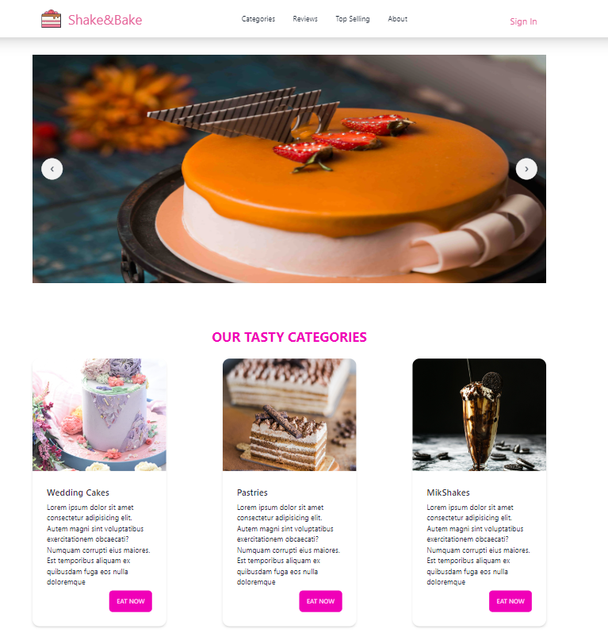

# ShakeAndBake <a href="https://notes-app-bo24.onrender.com" style="font-size:1rem;margin-left:2rem">Live Site</a>

Welcome to our delightful E-commerce platform dedicated to bringing you the finest cakes and milkshakes. Powered by the MERN (MongoDB, Express.js, React, Node.js,TailwindCSS) stack, our platform ensures a seamless shopping experience. Below are the key functionalities that enhance your shopping journey:

## Key Functionalities:

### 1. CRUD Operations:

- **Create, Read, Update, Delete (CRUD) operations** are seamlessly integrated into our Admin Portal, providing easy management of products.

### 2. Pagination:

- Effortlessly navigate through our extensive product inventory with our efficient **pagination system**. Find the perfect cakes and milkshakes without overwhelming page loads.

### 3. Searching by Product Name:

- Quickly locate your favorite products by utilizing the **search functionality**. Simply enter the product name, and our platform will provide instant results.

### 4. Filter by Type and Category:

- Tailor your shopping experience by filtering products based on **type (cakes, milkshakes)** and **categories (e.g., birthday-cakes,anniversary-cakes etc)**.

### 5. Review System for Customers:

- Share your experiences with others by leaving **reviews for products**. Read customer reviews to make informed decisions and contribute to our growing community.

### 6. Stripe Payment Integration:

- Enjoy a secure and hassle-free checkout process with our integrated **Stripe payment system**. Safely make online transactions with ease, using credit or debit cards.

Feel free to indulge in the sweet experience of our E-commerce platform for cakes and milkshakes. For any inquiries or assistance, contact our customer support. Happy shopping!
